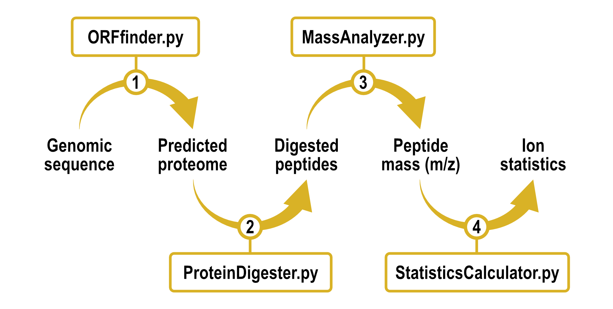
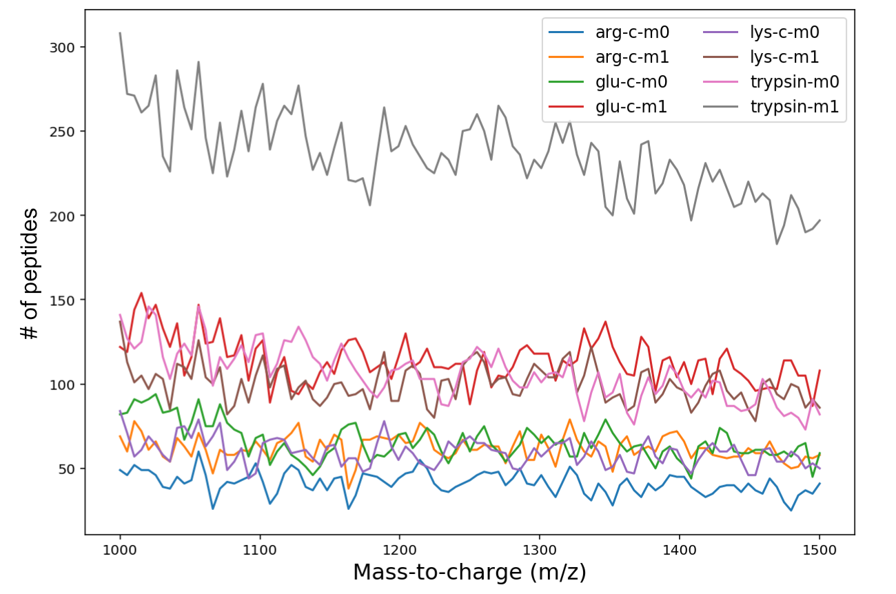

 <!---  -->


# *In silico* proteome analysis

> This repository contains a collection of Python scripts that can be used to computationally predict
> a reference proteome for a given genome sequence and optimize enzymatic digestion for MS-based approaches.
> The code was developed as a practice exercise and is provided as is for those learning and/or seeking for inspiration.
> Kindly drop a :star: if this is helpful!

|  |
|:--:|
| ***In silico proteome analysis workflow.*** |


## Usage

### 1. *Ab initio* protein-coding gene prediction

`01_ORFfinder.py` is an Open Reading Frame (ORF) finder for prokariotic genomic sequences.
Each input file must be fasta formatted and at least one filename is required for the program to run.
A single path to a directory can be used as input if batch mode is enabled (`-b` option). By default, 
ORFs are identified in all six reading frames and the minimum length threshold is set to 300 nucleotides 
(99 amino acids). `STDOUT` is used by default for all ORF predictions, but an output file can be 
specified with `-o`. 

For demonstration purposes and to keep things simple we work with a small example sequence:

```
$ cat data/genome.fa
>ENA|HZ245980|HZ245980.1
ATGCCCCCCTACACCGTGGTGTACTTCCCCGTGAGAGGCAGATGCGCCGCCCTGAGAATGCTGCTGGCC
GACCAGGGCCAGAGCTGGAAGGAGGAGGTGGTGACCGTGGAGACCTGGCAGGAGGGCAGCCTGAAGGCC
AGCTGCCTGTACGGCCAGCTGCCCAAGTTCCAGGACGGCGACCTGACCCTGTACCAGAGCAACACCATC
CTGAGACACCTGGGCAGAACCCTGGGCCTGTACGGCAAGGACCAGCAGGAGGCCGCCCTGGTGGACATG
GTGAACGACGGCGTGGAGGACCTGAGATGCAAGTACATCAGCCTGATCTACACCAACTACGAGGCCGGC
AAGGACGACTACGTGAAGGCCCTGCCCGGCCAGCTGAAGCCCTTCGAGACCCTGCTGAGCCAGAACCAG
GGCGGCAAGACCTTCATCGTGGGCGACCAGATCAGCTTCGCCGACTACAACCTGCTGGACCTGCTGCTG
ATCCACGAGGTGCTGGCCCCCGGCTGCCTGGACGCCTTCCCCCTGCTGAGCGCCTACGTGGGCAGACTG
AGCGCCAGACCCAAGCTGAAGGCCTTCCTGGCCAGCCCCGAGTACGTGAACCTGCCCATCAACGGCAAC
GGCAAGCAGTAG
$
$ python3 01_ORFfinder.py data/genome.fa
>ENA|HZ245980|HZ245980.1 frame=+1 protein=1 loc=0:632 length=210
MPPYTVVYFPVRGRCAALRMLLADQGQSWKEEVVTVETWQEGSLKASCLYGQLPKFQDGDLTLYQSNTIL
RHLGRTLGLYGKDQQEAALVDMVNDGVEDLRCKYISLIYTNYEAGKDDYVKALPGQLKPFETLLSQNQGG
KTFIVGDQISFADYNLLDLLLIHEVLAPGCLDAFPLLSAYVGRLSARPKLKAFLASPEYVNLPINGNGKQ
>ENA|HZ245980|HZ245980.1 frame=-2 protein=2 loc=313:8 length=101
MYLHLRSSTPSFTMSTRAASCWSLPYRPRVLPRCLRMVLLWYRVRSPSWNLGSWPYRQLAFRLPSCQVST
VTTSSFQLWPWSASSILRAAHLPLTGKYTTV
$
$ python3 01_ORFfinder.py data/genome.fa -o data/proteome.fa
```

The minimum length for ORF detection can be changed by passing the `-ml` argument. For instance,
lowering the 300 nucleotides limit to 30 adds two more proteins to the output for this example.

```
$ python3 01_ORFfinder.py data/genome.fa -ml 30
>ENA|HZ245980|HZ245980.1 frame=+1 protein=1 loc=0:632 length=210
MPPYTVVYFPVRGRCAALRMLLADQGQSWKEEVVTVETWQEGSLKASCLYGQLPKFQDGDLTLYQSNTIL
RHLGRTLGLYGKDQQEAALVDMVNDGVEDLRCKYISLIYTNYEAGKDDYVKALPGQLKPFETLLSQNQGG
KTFIVGDQISFADYNLLDLLLIHEVLAPGCLDAFPLLSAYVGRLSARPKLKAFLASPEYVNLPINGNGKQ
>ENA|HZ245980|HZ245980.1 frame=-2 protein=2 loc=610:536 length=24
MGRFTYSGLARKAFSLGLALSLPT
>ENA|HZ245980|HZ245980.1 frame=-2 protein=3 loc=430:353 length=25
MKVLPPWFWLSRVSKGFSWPGRAFT
>ENA|HZ245980|HZ245980.1 frame=-2 protein=4 loc=313:8 length=101
MYLHLRSSTPSFTMSTRAASCWSLPYRPRVLPRCLRMVLLWYRVRSPSWNLGSWPYRQLAFRLPSCQVST
VTTSSFQLWPWSASSILRAAHLPLTGKYTTV
```

The tool also allows cdna output, frame selection and filtering of overlapping ORFs by 
passing the `-t`, `-f` and `-fov` arguments, respectively.

```
$ python3 01_ORFfinder.py data/genome.fa -ml 30 -f -2
>ENA|HZ245980|HZ245980.1 frame=-2 protein=1 loc=610:536 length=24
MGRFTYSGLARKAFSLGLALSLPT
>ENA|HZ245980|HZ245980.1 frame=-2 protein=2 loc=430:353 length=25
MKVLPPWFWLSRVSKGFSWPGRAFT
>ENA|HZ245980|HZ245980.1 frame=-2 protein=3 loc=313:8 length=101
MYLHLRSSTPSFTMSTRAASCWSLPYRPRVLPRCLRMVLLWYRVRSPSWNLGSWPYRQLAFRLPSCQVST
VTTSSFQLWPWSASSILRAAHLPLTGKYTTV
$
$ python3 01_ORFfinder.py data/genome.fa -ml 30 -fov length
>ENA|HZ245980|HZ245980.1 frame=+1 protein=1 loc=0:632 length=210
MPPYTVVYFPVRGRCAALRMLLADQGQSWKEEVVTVETWQEGSLKASCLYGQLPKFQDGDLTLYQSNTIL
RHLGRTLGLYGKDQQEAALVDMVNDGVEDLRCKYISLIYTNYEAGKDDYVKALPGQLKPFETLLSQNQGG
KTFIVGDQISFADYNLLDLLLIHEVLAPGCLDAFPLLSAYVGRLSARPKLKAFLASPEYVNLPINGNGKQ
$
$ python3 01_ORFfinder.py data/genome.fa -ml 30 -fov length -t cdna
>ENA|HZ245980|HZ245980.1 frame=+1 cdna=1 loc=0:632 length=633
ATGCCCCCCTACACCGTGGTGTACTTCCCCGTGAGAGGCAGATGCGCCGCCCTGAGAATGCTGCTGGCCG
ACCAGGGCCAGAGCTGGAAGGAGGAGGTGGTGACCGTGGAGACCTGGCAGGAGGGCAGCCTGAAGGCCAG
CTGCCTGTACGGCCAGCTGCCCAAGTTCCAGGACGGCGACCTGACCCTGTACCAGAGCAACACCATCCTG
AGACACCTGGGCAGAACCCTGGGCCTGTACGGCAAGGACCAGCAGGAGGCCGCCCTGGTGGACATGGTGA
ACGACGGCGTGGAGGACCTGAGATGCAAGTACATCAGCCTGATCTACACCAACTACGAGGCCGGCAAGGA
CGACTACGTGAAGGCCCTGCCCGGCCAGCTGAAGCCCTTCGAGACCCTGCTGAGCCAGAACCAGGGCGGC
AAGACCTTCATCGTGGGCGACCAGATCAGCTTCGCCGACTACAACCTGCTGGACCTGCTGCTGATCCACG
AGGTGCTGGCCCCCGGCTGCCTGGACGCCTTCCCCCTGCTGAGCGCCTACGTGGGCAGACTGAGCGCCAG
ACCCAAGCTGAAGGCCTTCCTGGCCAGCCCCGAGTACGTGAACCTGCCCATCAACGGCAACGGCAAGCAG
TAG
```

For additional usage information the help option `-h` can be passed as an argument.

```
$ python3 01_ORFfinder.py -h
usage: 01_ORFfinder.py [-h] [-b] [-o OUTPUT] [-f {+1,+2,+3,-1,-2,-3} [{+1,+2,+3,-1,-2,-3} ...]] [-ml MINIMUM_LENGTH]
                       [-a] [-fov {length,cai}] [-t {protein,cdna}] [-fmt FORMAT]
                       input [input ...]

Search open reading frames (ORFs) in a sequence.

positional arguments:
  input                 Enter file/s to analyze (for path to directory enable batch mode option.)

optional arguments:
  -h, --help            show this help message and exit
  -b, --batch           Enables batch mode for processing all '.fasta' files in a directory. Path to directory must be
                        specified as input.
  -o OUTPUT, --output OUTPUT
                        Allows output to specified file.
  -f {+1,+2,+3,-1,-2,-3} [{+1,+2,+3,-1,-2,-3} ...], --frames {+1,+2,+3,-1,-2,-3} [{+1,+2,+3,-1,-2,-3} ...]
                        Allows a customized selection of reading frames for ORF search. Default is all reading frames.
  -ml MINIMUM_LENGTH, --minimum_length MINIMUM_LENGTH
                        Allows a customized minimum length threshold for ORF detection. Default is 300 nucleotides.
  -a, --ambiguities     Enables the detection of ORFs containing ambiguous nucleotides.
  -fov {length,cai}, --filter_overlaps {length,cai}
                        Allows filtering overlapping ORFs based on the selected criteria ('length' or 'cai').
  -t {protein,cdna}, --type {protein,cdna}
                        Allows a custom ORF output type. Default is in protein sequences.
  -fmt FORMAT, --format FORMAT
                        Allows a customized line length for the ORF output. Default is 70 characters per line.
```


### 2. *In silico* protein digestion

`02_ProteinDigester.py` allows to digest one or more protein sequences into smaller peptides.
Input is in fasta format and batch mode is possible with `-b`. Peptide sequence output is to
`STDOUT` unless a file path is provided via the `-o` argument.

```
$ python3 02_ProteinDigester.py data/proteome.fa | head -n 10
>ENA|HZ245980|HZ245980.1 frame=+1 protein=1 loc=0:632 length=210 peptide=1 enzyme=trypsin missed=0 type=N
MPPYTVVYFPVR
>ENA|HZ245980|HZ245980.1 frame=+1 protein=1 loc=0:632 length=210 peptide=2 enzyme=trypsin missed=0 type=I
GR
>ENA|HZ245980|HZ245980.1 frame=+1 protein=1 loc=0:632 length=210 peptide=3 enzyme=trypsin missed=0 type=I
CAALR
>ENA|HZ245980|HZ245980.1 frame=+1 protein=1 loc=0:632 length=210 peptide=4 enzyme=trypsin missed=0 type=I
MLLADQGQSWK
>ENA|HZ245980|HZ245980.1 frame=+1 protein=1 loc=0:632 length=210 peptide=5 enzyme=trypsin missed=0 type=I
EEVVTVETWQEGSLK
$
$ python3 02_ProteinDigester.py data/proteome.fa -o data/peptides.fa
```

*Trypsin* is used by default for digestion but user-defined choice of other digesting enzymes is possible
with `-e`. For instance, `-e r` or `-e e` can be used for *Arg-C* or *Glu-C* digestion, respectively.

```
$ python3 02_ProteinDigester.py data/proteome.fa -e r | head -n 10
>ENA|HZ245980|HZ245980.1 frame=+1 protein=1 loc=0:632 length=210 peptide=1 enzyme=arg-c missed=0 type=N
MPPYTVVYFPVR
>ENA|HZ245980|HZ245980.1 frame=+1 protein=1 loc=0:632 length=210 peptide=2 enzyme=arg-c missed=0 type=I
GR
>ENA|HZ245980|HZ245980.1 frame=+1 protein=1 loc=0:632 length=210 peptide=3 enzyme=arg-c missed=0 type=I
CAALR
>ENA|HZ245980|HZ245980.1 frame=+1 protein=1 loc=0:632 length=210 peptide=4 enzyme=arg-c missed=0 type=I
MLLADQGQSWKEEVVTVETWQEGSLKASCLYGQLPKFQDGDLTLYQSNTILR
>ENA|HZ245980|HZ245980.1 frame=+1 protein=1 loc=0:632 length=210 peptide=5 enzyme=arg-c missed=0 type=I
HLGR
$
$ python3 02_ProteinDigester.py data/proteome.fa -e e | head -n 10
>ENA|HZ245980|HZ245980.1 frame=+1 protein=1 loc=0:632 length=210 peptide=1 enzyme=glu-c missed=0 type=N
MPPYTVVYFPVRGRCAALRMLLADQGQSWKE
>ENA|HZ245980|HZ245980.1 frame=+1 protein=1 loc=0:632 length=210 peptide=2 enzyme=glu-c missed=0 type=I
E
>ENA|HZ245980|HZ245980.1 frame=+1 protein=1 loc=0:632 length=210 peptide=3 enzyme=glu-c missed=0 type=I
VVTVE
>ENA|HZ245980|HZ245980.1 frame=+1 protein=1 loc=0:632 length=210 peptide=4 enzyme=glu-c missed=0 type=I
TWQE
>ENA|HZ245980|HZ245980.1 frame=+1 protein=1 loc=0:632 length=210 peptide=5 enzyme=glu-c missed=0 type=I
GSLKASCLYGQLPKFQDGDLTLYQSNTILRHLGRTLGLYGKDQQE
```

Different numbers of missed cleavages, i.e. instances where the enzyme fails to digest a putative cutsite, 
can be considered with `-m`. Passing `-m 2` as an argument will return peptides with up to two missed cleavages.

```
$ python3 02_ProteinDigester.py data/proteome.fa -m 2 | head -n 10
>ENA|HZ245980|HZ245980.1 frame=+1 protein=1 loc=0:632 length=210 peptide=1 enzyme=trypsin missed=0 type=N
MPPYTVVYFPVR
>ENA|HZ245980|HZ245980.1 frame=+1 protein=1 loc=0:632 length=210 peptide=2 enzyme=trypsin missed=1 type=N
MPPYTVVYFPVRGR
>ENA|HZ245980|HZ245980.1 frame=+1 protein=1 loc=0:632 length=210 peptide=3 enzyme=trypsin missed=2 type=N
MPPYTVVYFPVRGRCAALR
>ENA|HZ245980|HZ245980.1 frame=+1 protein=1 loc=0:632 length=210 peptide=4 enzyme=trypsin missed=0 type=I
GR
>ENA|HZ245980|HZ245980.1 frame=+1 protein=1 loc=0:632 length=210 peptide=5 enzyme=trypsin missed=1 type=I
GRCAALR
```

Peptides can also be filtered by sequence origin with `-t`. `-t N` will return all *N-terminal* peptides 
and `-t C` will return all *C-terminal* ones.

```
$ python3 02_ProteinDigester.py data/proteome.fa -m 2 -t N | head -n 10
>ENA|HZ245980|HZ245980.1 frame=+1 protein=1 loc=0:632 length=210 peptide=1 enzyme=trypsin missed=0 type=N
MPPYTVVYFPVR
>ENA|HZ245980|HZ245980.1 frame=+1 protein=1 loc=0:632 length=210 peptide=2 enzyme=trypsin missed=1 type=N
MPPYTVVYFPVRGR
>ENA|HZ245980|HZ245980.1 frame=+1 protein=1 loc=0:632 length=210 peptide=3 enzyme=trypsin missed=2 type=N
MPPYTVVYFPVRGRCAALR
>ENA|HZ245980|HZ245980.1 frame=-2 protein=2 loc=313:8 length=101 peptide=1 enzyme=trypsin missed=0 type=N
MYLHLR
>ENA|HZ245980|HZ245980.1 frame=-2 protein=2 loc=313:8 length=101 peptide=2 enzyme=trypsin missed=1 type=N
MYLHLRSSTPSFTMSTR
$
$ python3 02_ProteinDigester.py data/proteome.fa -m 2 -t C | head -n 10
>ENA|HZ245980|HZ245980.1 frame=+1 protein=1 loc=0:632 length=210 peptide=51 enzyme=trypsin missed=2 type=C
LKAFLASPEYVNLPINGNGKQ
>ENA|HZ245980|HZ245980.1 frame=+1 protein=1 loc=0:632 length=210 peptide=53 enzyme=trypsin missed=1 type=C
AFLASPEYVNLPINGNGKQ
>ENA|HZ245980|HZ245980.1 frame=+1 protein=1 loc=0:632 length=210 peptide=54 enzyme=trypsin missed=0 type=C
Q
>ENA|HZ245980|HZ245980.1 frame=-2 protein=2 loc=313:8 length=101 peptide=30 enzyme=trypsin missed=2 type=C
LPSCQVSTVTTSSFQLWPWSASSILRAAHLPLTGKYTTV
>ENA|HZ245980|HZ245980.1 frame=-2 protein=2 loc=313:8 length=101 peptide=32 enzyme=trypsin missed=1 type=C
AAHLPLTGKYTTV
```

More usage information with `-h`:

```
$ python3 02_ProteinDigester.py -h
usage: 02_ProteinDigester.py [-h] [-o OUTPUT] [-e {t,k,v,r,x,e}] [-m {0,1,2,3,4,5}] [-t {N,I,C,all}] [-b]
                             input [input ...]

Digest protein sequences to peptides.

positional arguments:
  input                 Enter fasta file with protein sequences to digest.

optional arguments:
  -h, --help            show this help message and exit
  -o OUTPUT, --output OUTPUT
                        Allows output to specified file.
  -e {t,k,v,r,x,e}, --enzyme {t,k,v,r,x,e}
                        Allows selecting different enzymes for digestion: trypsin (t), lys-c (k), Staph-v8 (v),
                        arg-c (r), trypsin-acetyl (x) or glu-c (e).
  -m {0,1,2,3,4,5}, --missed {0,1,2,3,4,5}
                        Allows setting different numbers of missed cleavages (0-5 are allowed).
  -t {N,I,C,all}, --type {N,I,C,all}
                        Allows filtering for peptide origin: n-terminal (N), internal (I), c-terminal (C) or
                        all.
  -b, --batch           Enables batch mode for processing all '.fasta' files in a directory. Path to directory
                        must be specified as input.
```


### 3. Calculate peptide masses

`03_MassAnalyzer.py` allows to transform peptide sequence information into *mass-to-charge (m/z)* values.
Input is in fasta format and batch mode is possible with `-b`. A tab-delimited table with peptide 
information is produced as `STDOUT` unless a file path is provided via the `-o` argument.

Note: mass calculation assumes that all peptides are ions of +1 charge.

```
$ python3 03_MassAnalyzer.py data/peptides.fa | head -n 6
id      protein peptide mass-to-charge  z       missed  enzyme  type    sequence
ENA|HZ245980|HZ245980.1 1       1       1468.759        1       0       trypsin N       MPPYTVVYFPVR
ENA|HZ245980|HZ245980.1 1       2       232.133 1       0       trypsin I       GR
ENA|HZ245980|HZ245980.1 1       3       533.279 1       0       trypsin I       CAALR
ENA|HZ245980|HZ245980.1 1       4       1276.628        1       0       trypsin I       MLLADQGQSWK
ENA|HZ245980|HZ245980.1 1       5       1733.852        1       0       trypsin I       EEVVTVETWQEGSLK
$
$ python3 03_MassAnalyzer.py data/peptides.fa -o data/masses.tsv
```

*Monoisotopic* amino acid masses are used by default, although additional options are available
with `-m`. For instance, `-m 1` will use *average* amino acid masses instead, and `-m 4` will 
account for oxidation of methionines.

```
$ python3 03_MassAnalyzer.py data/peptides.fa -m 1 | head -n 6
id      protein peptide mass-to-charge  z       missed  enzyme  type    sequence
ENA|HZ245980|HZ245980.1 1       1       1469.785        1       0       trypsin N       MPPYTVVYFPVR
ENA|HZ245980|HZ245980.1 1       2       232.255 1       0       trypsin I       GR
ENA|HZ245980|HZ245980.1 1       3       533.665 1       0       trypsin I       CAALR
ENA|HZ245980|HZ245980.1 1       4       1277.465        1       0       trypsin I       MLLADQGQSWK
ENA|HZ245980|HZ245980.1 1       5       1734.885        1       0       trypsin I       EEVVTVETWQEGSLK
$
$ python3 03_MassAnalyzer.py data/peptides.fa -m 4 | head -n 6
id      protein peptide mass-to-charge  z       missed  enzyme  type    sequence
ENA|HZ245980|HZ245980.1 1       1       1484.753        1       0       trypsin N       MPPYTVVYFPVR
ENA|HZ245980|HZ245980.1 1       2       232.133 1       0       trypsin I       GR
ENA|HZ245980|HZ245980.1 1       3       533.279 1       0       trypsin I       CAALR
ENA|HZ245980|HZ245980.1 1       4       1292.623        1       0       trypsin I       MLLADQGQSWK
ENA|HZ245980|HZ245980.1 1       5       1733.852        1       0       trypsin I       EEVVTVETWQEGSLK
```

Filtering by peptide location in the original protein is also possible with `-t`.
`-t N` for *N-terminal* peptides and `-t C` for *C-terminal* ones.

```
$ python3 03_MassAnalyzer.py data/peptides.fa -t N | head -n 6
id      protein peptide mass-to-charge  z       missed  enzyme  type    sequence
ENA|HZ245980|HZ245980.1 1       1       1468.759        1       0       trypsin N       MPPYTVVYFPVR
ENA|HZ245980|HZ245980.1 2       1       832.443 1       0       trypsin N       MYLHLR
$
$ python3 03_MassAnalyzer.py data/peptides.fa -t C | head -n 6
id      protein peptide mass-to-charge  z       missed  enzyme  type    sequence
ENA|HZ245980|HZ245980.1 1       19      147.069 1       0       trypsin C       Q
ENA|HZ245980|HZ245980.1 2       12      483.238 1       0       trypsin C       YTTV
```

Usage information:

```
$ python3 03_MassAnalyzer.py -h
usage: 03_MassAnalyzer.py [-h] [-o OUTPUT] [-m {0,1,2,3,4,5,6,7}] [-t {N,I,C,all}] [-b]
                          input [input ...]

Calculate mass for peptide sequences.

positional arguments:
  input                 Enter fasta file with peptide sequences.

optional arguments:
  -h, --help            show this help message and exit
  -o OUTPUT, --output OUTPUT
                        Allows output to specified file.
  -m {0,1,2,3,4,5,6,7}, --masses {0,1,2,3,4,5,6,7}
                        Allows to consider different modifications for calculating peptide mass: (0)
                        Monoisotopic, (1) Average, (2) Monoisotopic + Phosphorylation (Ser, Tyr and
                        Thr), (3) Average + Phosphorylation (Ser, Tyr and Thr), (4) Monoisotopic +
                        Oxidation (Met), (5) Average + Oxidation (Met), (6) Monoisotopic +
                        Phosphorylation (Ser, Tyr and Thr) + Oxidation (Met), (7) Average +
                        Phosphorylation (Ser, Tyr and Thr) + Oxidation (Met)
  -t {N,I,C,all}, --type {N,I,C,all}
                        Allows filtering masses for peptide origin: n-terminal (N), internal (I),
                        c-terminal (C) or all.
  -b, --batch           Enables batch mode for processing all '.fasta' files in a directory. Path to
                        directory must be specified as input.
```


### 4. Calculate peptide statistics

`04_StatisticsCalculator.py` allows to bin peptides according to their *mass-to-charge* values
and simulate the detection of a mass spectrometer. User-defined binning is possible using a sliding
window approach, which allows modeling the mass accuracy of the instrument. Input is in the form of
a tab-delimited table with peptide information. `STDOUT` is used for output of bins unless a file 
path is provided via the `-o` argument.

```
$ python3 04_StatisticsCalculator.py data/masses.tsv | head -n 16
range (Da)      average count   peptides
1000:1010       0       0       NA
1005:1015       0       0       NA
1010:1020       0       0       NA
1015:1025       0       0       NA
1020:1030       0       0       NA
1025:1035       0       0       NA
1030:1040       0       0       NA
1035:1045       0       0       NA
1040:1050       0       0       NA
1045:1055       0       0       NA
1050:1060       0       0       NA
1055:1065       0       0       NA
1060:1070       0       0       NA
1065:1075       0       0       NA
1070:1080       1079.548        1       1.6
$
$ python3 04_StatisticsCalculator.py data/masses.tsv -o data/stats.tsv
```

By default, the tool considers a detection range of 1000-1500Da, a window size of 10Da, and 
a step size of 5Da. This can be changed with the `-r`, `-w` and `-s` arguments, respectively

```
$ python3 04_StatisticsCalculator.py data/masses.tsv -r 0 2000 -w 100 -s 100
range (Da)      average count   peptides
0:100   0       0       NA
100:200 0       0       NA
200:300 0       0       NA
300:400 0       0       NA
400:500 0       0       NA
500:600 0       0       NA
600:700 0       0       NA
700:800 0       0       NA
800:900 0       0       NA
900:1000        0       0       NA
1000:1100       1079.548        1       1.6
1100:1200       0       0       NA
1200:1300       1239.086        2       2.2;1.4
1300:1400       0       0       NA
1400:1500       1441.712        3       2.3;2.8;1.1
1500:1600       1534.772        1       1.12
1600:1700       0       0       NA
1700:1800       1733.852        1       1.5
1800:1900       1883.943        1       1.7
1900:2000       1903.984        1       1.18
```

Usage information:

```
$ python3 04_StatisticsCalculator.py -h
usage: 04_StatisticsCalculator.py [-h] [-o OUTPUT] [-r RANGE RANGE] [-s STEP]
                                  [-w WINDOW]
                                  input

Calculate mass spectrometry statistics for ionized peptides.

positional arguments:
  input                 Enter tab-delimited file with peptide information.

optional arguments:
  -h, --help            show this help message and exit
  -o OUTPUT, --output OUTPUT
                        Allows output to specified file.
  -r RANGE RANGE, --range RANGE RANGE
                        Allows specifying a custom range for peptide detection.
                        Default is 1000-1500 Da.
  -s STEP, --step STEP  Allows to select step size for sliding window analysis.
                        Default is 5 Da.
  -w WINDOW, --window WINDOW
                        Allows to select window size for sliding window analysis.
                        Default is 10 Da.
```


## Real-world example

So far we have worked with a small sample sequence with only a few detectable ORFs but
real genomes can have thousands of proteins. These tools can help evaluate several
digestion conditions for proteome *shotgun* experiments. 

This is how the peptide detection histogram would look like for a bacterial genome:

|  |
|:--:|
| ***Peptide counts in 1000-1500 m/z range following enzymatic digestion.*** |
